---
# You can also start simply with 'default'
theme: seriph
# random image from a curated Unsplash collection by Anthony
# like them? see https://unsplash.com/collections/94734566/slidev
background: ./images/title-bg.png
# some information about your slides (markdown enabled)
title: Welcome to Slidev
info: |
  ## Slidev Starter Template
  Presentation slides for developers.

  Learn more at [Sli.dev](https://sli.dev)
# apply unocss classes to the current slide
class: text-center
# https://sli.dev/features/drawing
drawings:
  persist: false
# slide transition: https://sli.dev/guide/animations.html#slide-transitions
transition: slide-left
# enable MDC Syntax: https://sli.dev/features/mdc
mdc: true
---

# Creating a WASM-Powered Plugin System For Your App

The Power of Extism

---
layout: image-right
image: ./images/self-portrait.jpg
---

# Introduction

- cmgriffing on all socials


- Software Dev for ~10 years
- Developer Advocate at GitKraken
- Twitch Programming Streamer
- Snowboarder


---

# What is WASM?

<h2 class="mt-32 max-w-160 mx-auto">
WebAssembly: a low-level assembly-like language with a compact binary format that runs with near-native performance
</h2>

<!--

according to MDN

-->

---

# The History of WASM

<ul class="ml-40 mt-8">
  <li>2011: Emscripten library started</li>
  <li>2011: Google NaCL (Native Client)</li>
  <li>2013: asm.js</li>
  <li>2015: WASM Announced</li>
  <li>2017: NaCL deprecated in favor of WASM</li>
  <li>2017: Broad browser support</li>
  <li>2019: WASM Threads enabled by default in Chrome</li>
  <li>2022: WASM 2.0 draft</li>
</ul>

---

<!-- hmm -->

<!-- # asm.js Briefly

```ts {all|1|2|5|9-10|14-16|all}
function BasicMathModule(stdlib, foreign, heap) {
  "use asm";

  // Variable Declarations
  var sqrt = stdlib.Math.sqrt;

  // Function Declarations
  function square(x) {
    x = +x;
    return +(x * x);
  }

  function add(x, y) {
    x = x | 0;
    y = y | 0;
    return (x + y) | 0;
  }

  return { square: square, add: add };
}
```
 -->

<!-- # The Birth and Death of JavaScript

A talk by Gary Bernhardt from PyCon 2014

https://www.destroyallsoftware.com/talks/the-birth-and-death-of-javascript

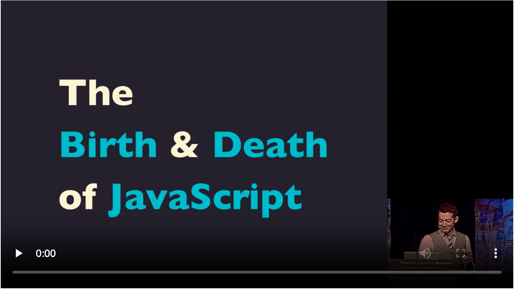 -->

<!--

- His talk focuses on asm.js
- Pronounces JS as YavaScript
- Comedic but still informative
- Predicted where this stuff could go

-->

# Popular Usage

<div class="grid grid-cols-2 w-full h-full auto-rows-fr items-center justify-center gap-x-32">

<v-clicks depth="2">

<div class="flex items-center justify-start">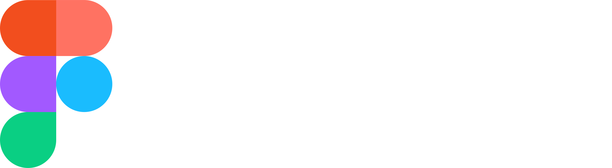</div>
<div class="flex items-center justify-start"></div>
<div class="flex items-center justify-start"></div>
<div class="flex items-center justify-start">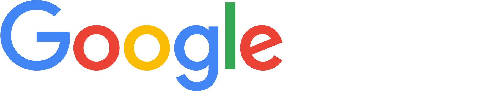</div>
<div class="flex items-center justify-start">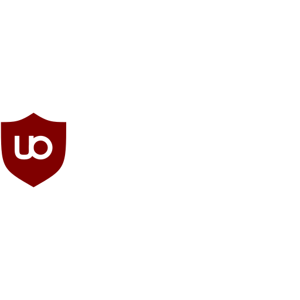</div>
<div class="flex items-center justify-start">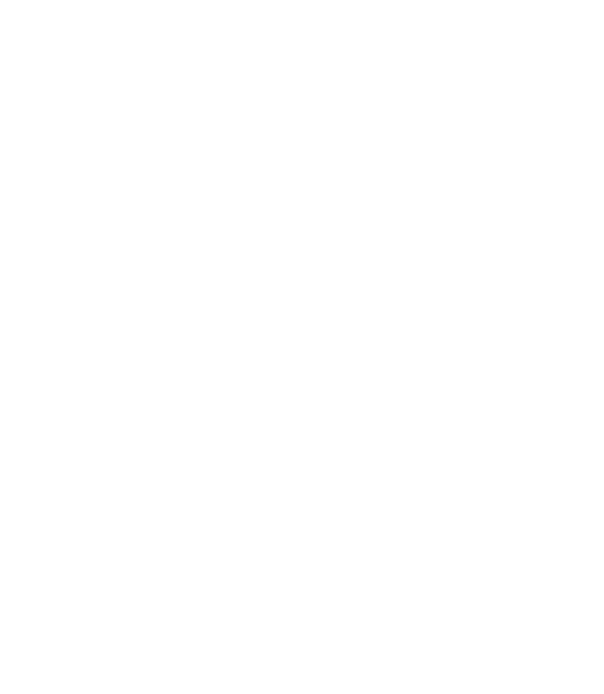<span class="text-[3.5rem]">Lichess.org</span></div>

</v-clicks>

</div>

---

# Running WASM (Browsers)
<!--
- All Major Browsers
  - Chrome
  - Firefox
  - Opera
  - Safari
  - Edge -->

All modern browsers


<div class="grid grid-cols-3 w-full h-full auto-rows-fr items-center justify-center gap-x-16">

<v-clicks depth="2">

<div class="flex items-center justify-center"></div>
<div class="flex items-center justify-center"></div>
<div class="flex items-center justify-center"></div>
<div class="flex items-center justify-center"></div>
<div class="flex items-center justify-center"></div>
<div class="flex items-center justify-center">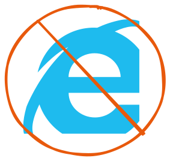</div>

</v-clicks>

</div>

---
layout: image-right
image: ./images/wasi.png
---

# WASI

<div class="mt-24">

WebAssembly System Interface

- Designed by Mozilla
- Provides POSIX-like features
  - Such as file I/O

</div>

---
layout: image-left
image: ./images/solomon-hykes.jpg
---

# WASM + WASI

> If WASM+WASI existed in 2008, we wouldn't have needed to create Docker. That's how important it is. WebAssembly on the server is the future of computing.

\- Solomon Hykes (2019), Creator of Docker

---

# Running WASM (outside browsers)

<div class="grid grid-cols-2 w-full h-full auto-rows-fr items-center justify-center gap-x-32">

<v-clicks depth="2">

<div class="flex items-center justify-start m-0"></div>
<div class="flex items-center justify-start m-0">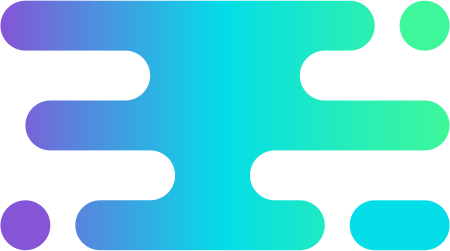<span class="text-[3.5rem]">Wasmtime</span></div>
<div class="flex items-center justify-start m-0">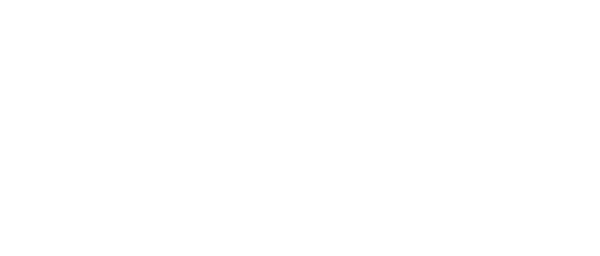</div>
<div class="flex items-center justify-start m-0"></div>

</v-clicks>

</div>

---

<div class="grid grid-cols-2 w-full h-full auto-rows-fr"><div class="slidev-layout default"><h1>Extism</h1><blockquote><p>a plug-in system for everyone</p></blockquote>
<ul>
<li>Built by Dylibso</li>
<li>BSD Licensed</li>
<li>Written in Rust</li>

</ul>
</div><div class="w-full h-auto" style="color: white; background-color: white; background-image: url(&quot;./images/extism-language-support.png&quot;); background-repeat: no-repeat; background-position: center center; background-size: contain;"></div></div>

---
layout: two-cols-header
---

# Extism Concepts: Hosts (SDKs)

::left::

- JS
  - Browsers
  - Node
- C/C++
- Elixir
- Go
- Haskell
- Java

::right::

- .NET
- OCaml
- Perl
- PHP
- Python
- Ruby
- Rust
- Zig

::bottom::

<div class="h-8 mt-8 mb-8"></div>

---
layout: two-cols-header
---

# Extism Concepts: Plug-ins (PDKs)

<div class="mt-8">PDK = Plug-in Development Kit</div>

::left::

- JS
- AssemblyScript
- C
- Go

::right::

- Haskell
- .NET
- Rust
- Zig

::bottom::

\* Possibly More. Get involved and contribute today!

<div class="h-8 mt-16 mb-16"></div>

---

# Extism Concepts: 2-way Communication

- Default: Hosts invoke plugin functions
- Optional: Plugins can invoke host functions

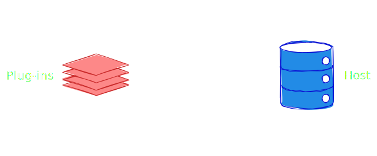


---
layout: image-right
image: ./images/memory-vertical.svg
class: max-w-full
---

# Extism Concepts: Memory

- Host/Plug-in: separately managed memory spaces
- Extism creates its own memory space for communication
- Communication is done via message passing
  - Objects must be serialized
    - JSON recommended

<!--

# Extism Concepts: CLI

/::left::

## Scaffolding plugins

```bash
extism generate plugin -o new-plugin
Select a PDK language to use for your plugin:

> 1. Rust
  2. JavaScript
  3. Go
  4. Zig
  5. C#
  6. F#
  7. C
  8. Haskell
  9. AssemblyScript
```

/::right::

## Testing plugins without a Host

```bash
extism call
  --input "this is a test"
  test/code.wasm count_vowels

# result:
{"count": 4}
```

/::bottom::

<div class="h-8 mt-8 mb-8"></div> -->


<!--
# Extism Concepts: HTTP API

Must use Extism API instead of native APIs

````md magic-move {lines: true}
```go
import (
	"encoding/json"
	"fmt"
	"net/http"

	"github.com/extism/go-pdk"
)

//go:export greet
func Greet() int32 {
	name := pdk.InputString()
	pdk.OutputString("Hello, " + name)

	bodyReader := bytes.NewReader([]byte(fmt.Printf(`{"name": "%s"}`, )))

	req, err := http.NewRequest(http.MethodPost, "https://localhost/echo", bodyReader)

	return 0
}
```

```go
import (
	"encoding/json"
	"fmt"

	"github.com/extism/go-pdk"
)

//go:export greet
func Greet() int32 {
	name := pdk.InputString()
	pdk.OutputString("Hello, " + name)

	req := pdk.NewHTTPRequest(pdk.MethodPost, "https://localhost/echo")
	req.SetBody([]byte(fmt.Printf(`{"name": "%s"}`, )))
	req.Send()

	return 0
}
```
```` -->

<!-- # Extism Notes: OutputString

OutputString will only happen once in each plugin function call

Last one wins

````md magic-move {lines: true}
```go
import (
	"github.com/extism/go-pdk"
)

//go:export greet
func Greet() int32 {
	name := pdk.InputString()
	pdk.OutputString("Hello, " + name)
	pdk.OutputString("Nice to meet you!")

	return 0
}
```

```go
import (
	"fmt"

	"github.com/extism/go-pdk"
)

//go:export greet
func Greet() int32 {
	name := pdk.InputString()

	hello := "Hello, " + name
	followup := "Nice to meet you!"

	pdk.OutputString(fmt.Sprintf("%s\n%s", hello, followup))

	return 0
}
```
```` -->

<!--
# TODO: Notes: Host Functions (JS only?)

# TODO: Notes: JS SDK Types -->

---

# Why Extism?

<div class="mt-8">
Exploring a plugin system for GitKraken (unofficial and unplanned for now)
</div>


<div class="grid grid-cols-2 w-full h-full auto-rows-fr items-start justify-center gap-x-32 mt-16">

<v-clicks>

<div>

## GitKraken Platform:

- CLI: Go
- GKD: Electron JS/TS
- GitLens: TS
- JetBrains Plugin: Java/Gradle
  - (planned, not available yet)

</div>

<div>

## Reasoning:

- Consistency
  - Process
  - Documentation
- Compatibility

</div>

</v-clicks>

</div>


<!--
GitKraken wants to meet developers where they work.

Which is why we have all of the different surfaces of our platform (cli, desktop, vscode, web, etc)

By the same token, we would want people to be able to develop plugins in their language of choice (within reason). Sorry, COBOL developers.

-->

---


# Considerations: Functionality

## Host Events

- Git (commit, push, etc)
- Files (create, delete, etc)
- Other (like a merged pull request)

## Host Functions

- Export functions that use user credentials
- Expose API data that we don't make public yet

---

# Considerations: UI Integration

<div class="flex flex-row items-start justify-center gap-x-16">

<div class="w-[45%]">

- New git providers
  - Gitea, Codeberg, etc.
- New task management tools
  - Linear, YouTrack, etc
- Theming
- Decluttering the UI

</div>

<div class="w-[70%]">


<v-switch>

<template #0>
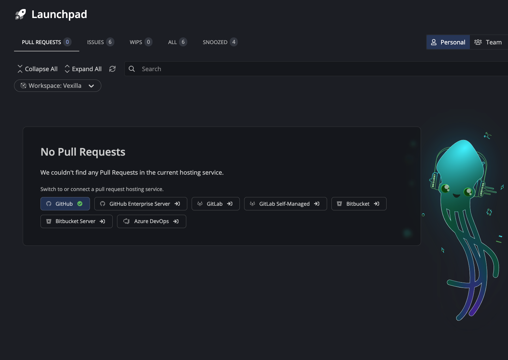
</template>
<template #1>
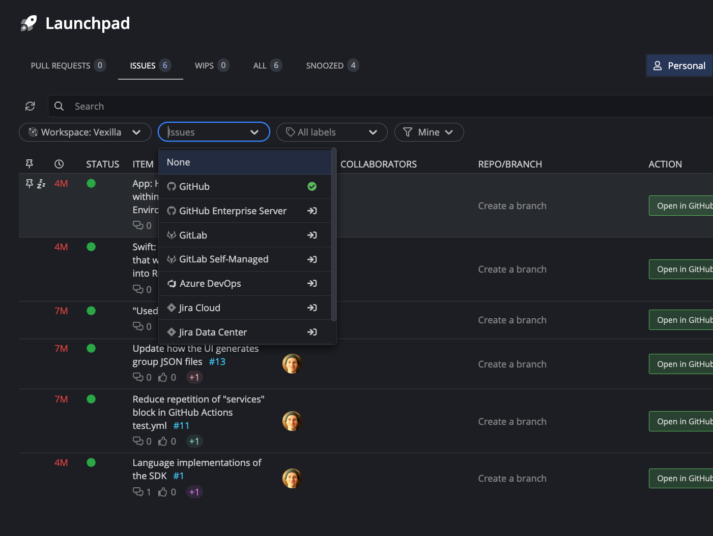
</template>
<template #2>
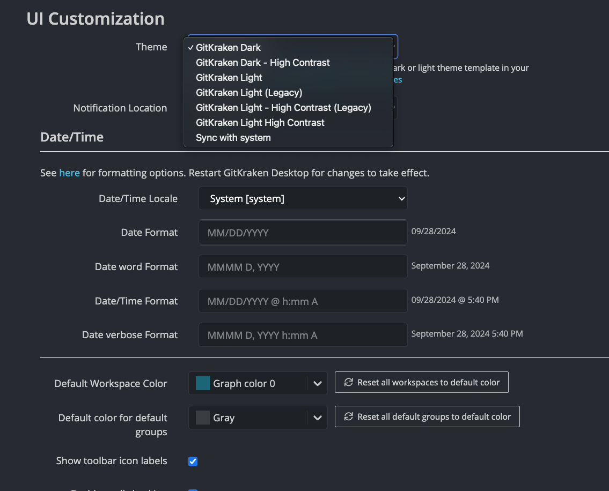
</template>
<template #3>
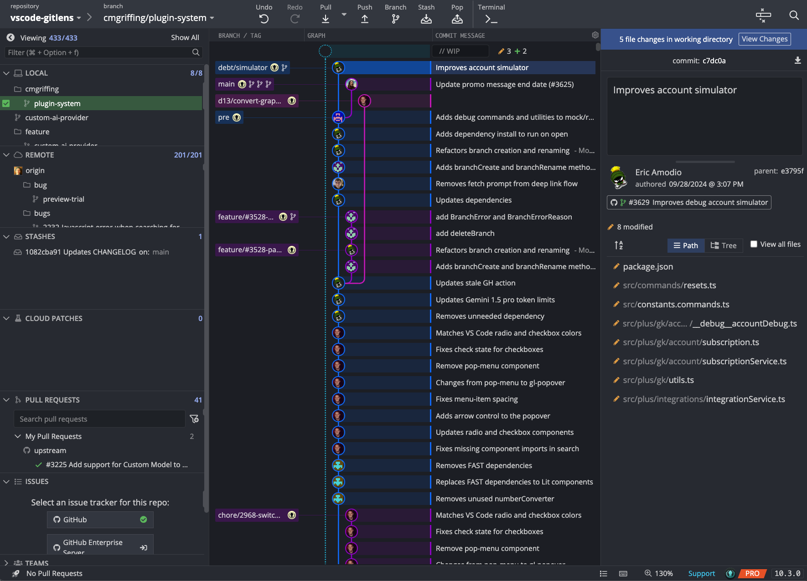
</template>


</v-switch>


</div>

</div>

---
layout: two-cols-header
---

# Considerations: Discoverability

::left::

How do we make it easy for people to discover and use plugins?

What about updating plugins?

::right::

<v-clicks>

- Hosted marketplace
- A review process
- User feedback and reviews
- Version checking and distribution

</v-clicks>


::bottom::

<div class="h-8 mt-16 mb-16"></div>


---
layout: two-cols-header
---

# Considerations: Documentation

::left::

Good Documentation is hard

Extism docs handle the basics of the plugin system

::right::

<v-clicks>

- Hosting
- Keeping docs up to date
- Example code
- Internationalization

</v-clicks>

::bottom::

<div class="h-8 mt-16 mb-16"></div>

---

# Inspiration: Real World Example

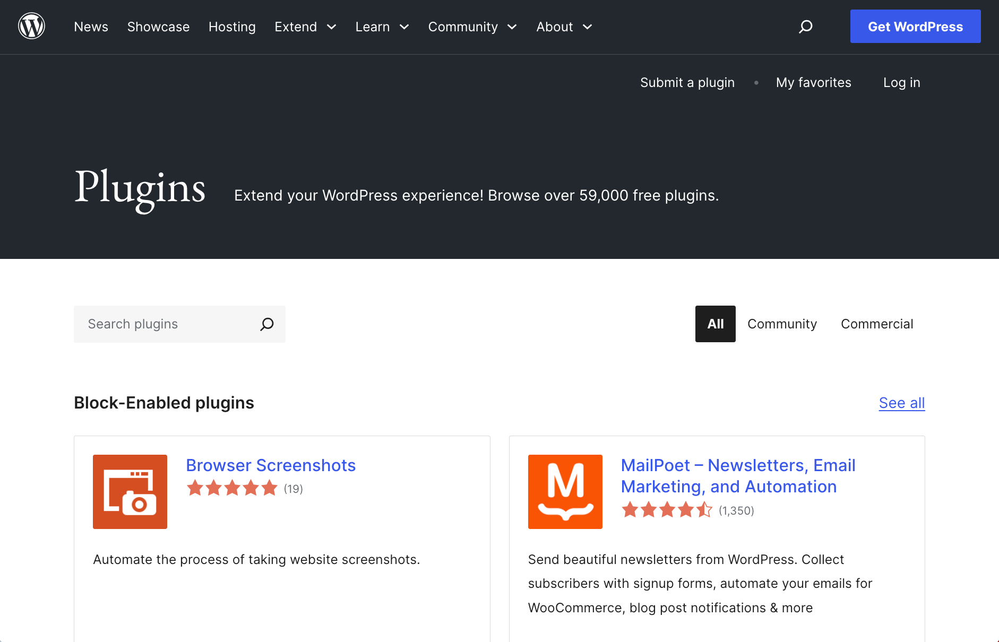

---
layout: cover
background: ./images/title-bg.png
---

# Thanks for listening!
